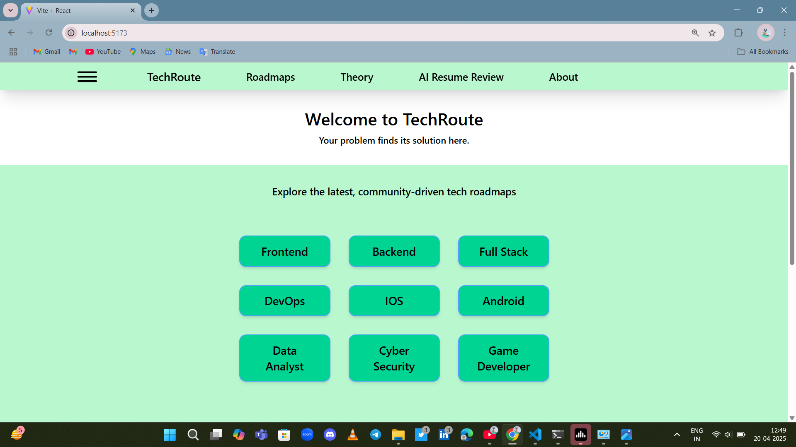
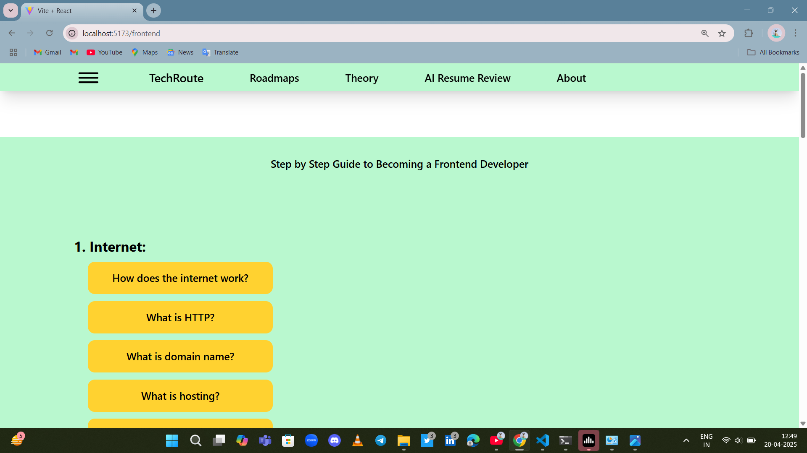
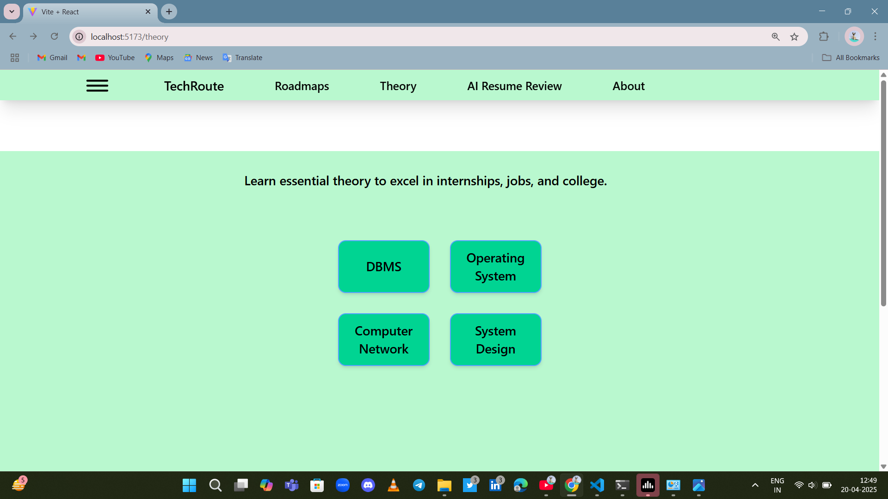
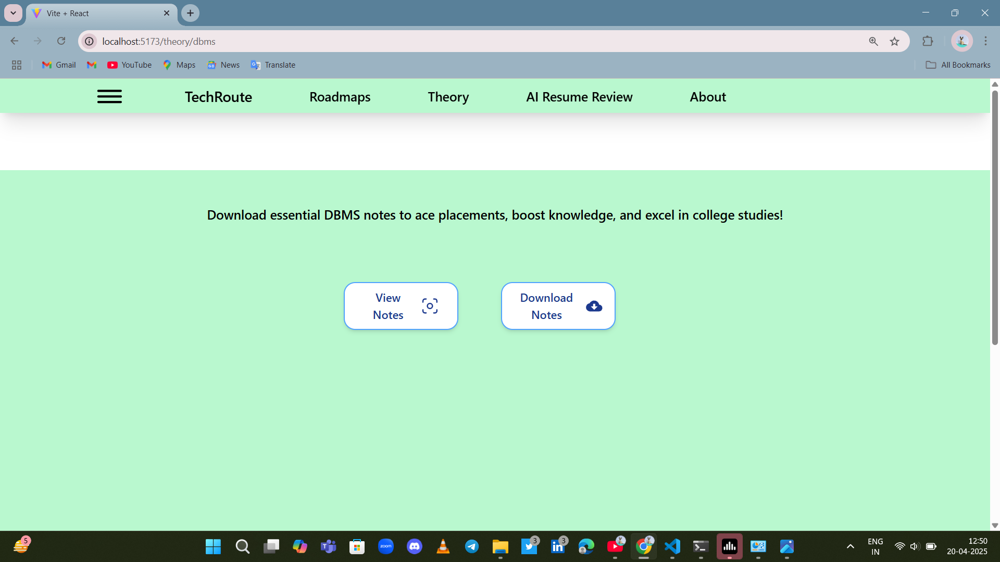
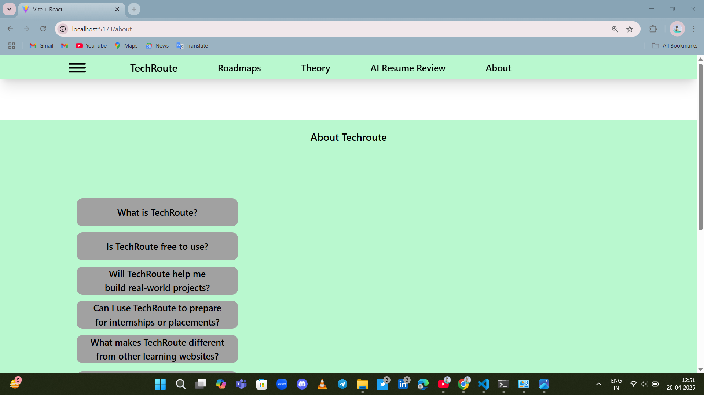

# TechRoute 🚀

**A tech career guidance web app built with React + Tailwind CSS**

---

## ✨ Features

- 📌 Frontend, Backend, Full-Stack, DevOps, iOS, Android,  
  Data Analyst, Cyber Security, Game Developer Career Roadmaps  
- 📚 Core Theory: DBMS, OS, CN, System Design  
- 💬 About Section + FAQs  

---

## 📸 Project Screenshots

### 📌 Screenshot 1  


### 📌 Screenshot 2  


### 📌 Screenshot 3  


### 📌 Screenshot 4  


### 📌 Screenshot 5  


---

## 🛠️ Tech Stack

- React  
- Tailwind CSS  
- React Router  
- Motion  

---

## 🚀 our next features i will add in this project is that:

- Ai resume review (where user upload thier resume and find their resume is perfect or not)
- signup/login
- feedback and improvment
- responsiveness

## 🚀 Getting Started (Optional for other developers)

```bash
npm install
npm run dev
